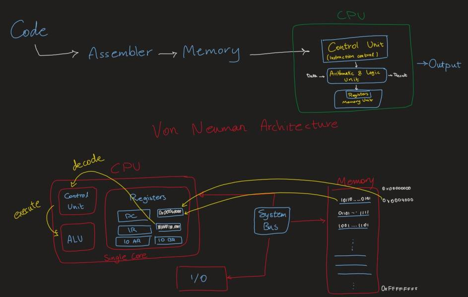

# Computer Architecture

Computer architecture encompasses the digital design and construction of computers, including their internal components and how they interact with each other. It involves understanding how computers are built, how they communicate through networks and protocols, and how they operate through an operating system.

Abstraction is a key concept in computer architecture. It involves simplifying the representation of complex systems to make them easier to understand and work with.

One important aspect of computer architecture is the Instruction Set Architecture (ISA). The ISA serves as a layer between the hardware and software, providing a set of operators such as logic and arithmetic operations that programmers can use.

Registers are small memory spaces within a computer system. They play a crucial role in computer architecture as they store data and instructions that the CPU (Central Processing Unit) needs to execute. Two important registers are:

- Memory Address Register (MAR): This register specifies the address for data to be read from or written to.
- Memory Buffer Register (MBR): This register holds the data that is being read from or written to memory.

Understanding the architecture of a computer involves studying the instruction set, the design of registers, and the locations where operands are stored (such as registers and memory).

